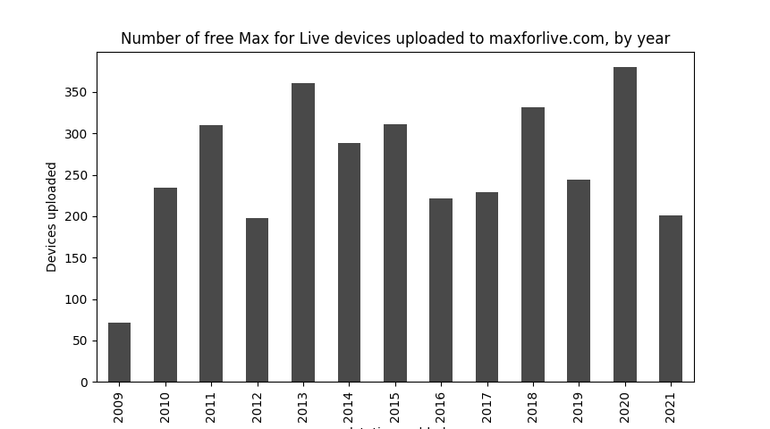
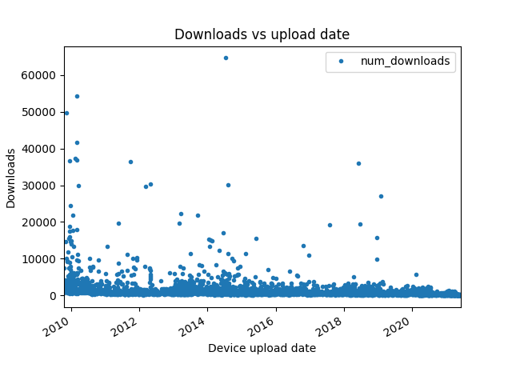

# Scrape M4L

Web scraping maxforlive.com for data analytics and programmatically downloading free maxforlive (M4L) devices.

# Motivation

There are thousands of M4L audio effect, midi effect, and instrument devices on maxforlive.com, most of which are free to downlaod.

This project was designed to *programmatically query all M4L devices on the official website*, and *apply filters* to, for example, select free devices that have been tested on your specific version of `Ableton Live`.  You may also filter by device category or date added.  

Once devices have been selected, a simple python function will *open all URLs into web browser tabs*, so you just need to click the 'Download Device' button.  

For users who wish to download thousands of devices in a *fully* automated way (i.e., without clicking a mouse), this last mouse-click step can be automated with Selenium.  I may upload code to do this at a later date.

This repo may also be used to analyze trends in elecronic music production and see which device types or tags are growing in popularity over time.  Such analytics are limited of course to the development of M4L devices, but nonetheless this offers a glimpse into the "evolution" of what I consider an exciting driving force behind sonic innovation.

# Results

My repository contains `Python` tools for web scraping maxforlive.com and also *includes my full results from scraping* in `all_devices.csv`. 

As of June 4th, 2021, I found 7368 device URLs, including for *5182 tested devices, out of which 3382 are free*.  The full dataset is in `all_devices.csv`. It contains the version of `Ableton Live` tested, number of downloads, device tags, device types, date added, URLs, and whether it is a free device. While I compiled data for all devices, I did not comprehensively scrape all data fields, so more info may be added later.

## Free M4L devices uploads are not accelerating, but 2020 and 2021 have slightly more uploads than previous years. 

I was expecting to see steady growth, and perhaps acccelerating or even exponential growth in free M4L device uploads.
That does not seem like it is the case.




The lack of steady growth in free M4L device development is surprising.  Perhaps audio developers are switching to other platforms for plug-in development, trying out other websites for releasing devices, or perhaps they are abandoning the free model and opting to sell their devices for profit.


I was also curious if the coronavirus pandemic lead to the development of free M4L devices while people had more time at home.
It looks like more free devices were uploaded in 2020 and 2021 than in previous years. 

## 88% of the most downloaded M4L devices were created before 2015.




As the following analysis shows,  only *12 of the top 100 most-downloaded free M4L devices were created in the last 7 years*.

```python
import pandas as pd
df = pd.read_csv('all_devices.csv')
free = df[(df.version != 'none') & df.free]
free['datetime_added'] = pd.to_datetime(free.date_added)
free = free[free['num_downloads'].str.isdigit()]
free['num_downloads'] = free['num_downloads'].astype(int) 
top_100 = free.sort_values(by = 'num_downloads', ascending = False).iloc[:100,:]
print(top_100[top_100.datetime_added.dt.year >= 2015])
```

```
      free version  ...   device_type                                         URL      datetime_added
4771  True      10  ...   midi_device  https://maxforlive.com/library/device/4771 2018-06-02 05:38:59
5228  True      10  ...   midi_device  https://maxforlive.com/library/device/5228 2019-01-26 11:58:24
4805  True      10  ...  audio_device  https://maxforlive.com/library/device/4805 2018-06-23 01:42:28
4260  True       9  ...   midi_device  https://maxforlive.com/library/device/4260 2017-08-03 03:59:53
5153  True      10  ...  audio_device  https://maxforlive.com/library/device/5153 2018-12-18 02:12:41
3035  True       9  ...  audio_device  https://maxforlive.com/library/device/3035 2015-06-04 09:36:20
3859  True       9  ...   midi_device  https://maxforlive.com/library/device/3859 2016-10-22 08:15:26
2833  True       9  ...   midi_device  https://maxforlive.com/library/device/2833 2015-02-17 11:18:37
3920  True       9  ...   midi_device  https://maxforlive.com/library/device/3920 2016-12-16 11:51:13
5158  True      10  ...   midi_device  https://maxforlive.com/library/device/5158 2018-12-20 16:42:04
3260  True       9  ...  audio_device  https://maxforlive.com/library/device/3260 2015-10-12 02:16:47
3660  True       9  ...   midi_device  https://maxforlive.com/library/device/3660 2016-05-31 13:05:45

[12 rows x 9 columns]
```

Older devices have been around longer and are likely to accumulate more downloads via a 'rich get richer' phenomenon.
However I was not expecting this effect to be so dramatic. 

## Newly made devices have fewer downloads

By taking the logarithm of the number of downloads per device, a downward trend in time emerges. It is clear that free devices have not been downloaded more, despite there being slightly more development in the last year.  However, it is important to keep in mind users have had less time to download these new plug-ins.


Downloads for free devices made between 2012 and 2020 tend to be in the thousands, whereas free devices made in 2021 tend to be in the hundreds.


# Repository requirements

* Python 3 (required)
* Pandas (recommended)
* matplotlib (optional, used only for plotting)

# Filtering devices and automatically opening URLs in your web browser

One purpose of this technique is to automate some of the clicking for downloading M4L devices.
The other purpose is to give users more flexibility for filtering than provided by maxforlive.com


## Recommended method -- using Pandas

```python
import pandas as pd
from urls import open_pandas_urls

# load the data into python.
d = pd.read_csv('all_devices.csv')
```

### filter data with pandas expressions.

```python
# here, select free devices and make sure the device has been tested on some version of Ableton Live.
free = df[(df.version != 'none') & df.free]

# select all free, Live 10-tested MIDI effect devices.  
live_10_midi = df[df.free & (df.version == '10') & (df.device_type == 'midi_effect')]
```

### Open URLs of selected devices 

The following has been tested only on a Unix environment and may not work on Windows.

```python
open_urls(live_10_midi)
```

## Using `pickle`

This is the way to go if you for whatever reason can't or don't want to use Pandas.

Pickled objects (python objects that have been saved using the `pickle` module. ) are convenient for loading results.  But they have been shown to be unsafe as they can hide malicious software programs.  Only use pickled objects if you trust the person who is sharing them.

```python
from urls import load_d, filter_d, open_urls 
# load the pickled object
d = load_d('all_devices.pkl')

# get all free devices tested on Ableton Live 10.
f = filter_d(d, version = '10', only_free = True)

# rather than using filter_d, you may do custom filtering with a list comprehension.
f = [x for x in d if x['device_type'] == 'midi_device' if int(x['num_downloads']) > 1000 ]

# how many devices were selected?
print(f.shape[0])

# open URLs to all selected devices.
open_urls(f, mode = 'pickle')
```

# Scraping data 

Users may wish to do the web scraping themselves.  A reason for wanting to do this would be getting the absolute most up-to-date data, (that is, more up-to-date than what is contained in `all_devices.csv`)

Code is located in the file `get_all_m4l.py`.  Reconfigure the `N_DEVICES` value to the most recently uploaded device on maxforlive.com, save it, and run `python get_all_m4l.py` 
